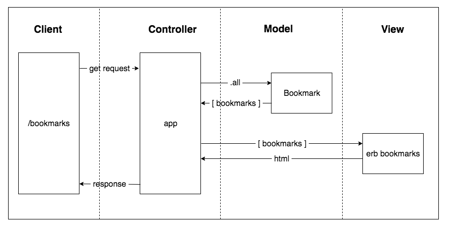

## User Stories

```
As a time-pressed user
So that I can quickly go to web sites I regularly visit
I would like to see a list of bookmarks
```

## Domain Model



## How to use

### How to setup the database
* Connect to psql
* Create the database using the psql command CREATE DATABASE bookmark_manager;
* Connect to the database using the pqsl command \c bookmark_manager;
* Run the query we have saved in the file 01_create_bookmarks_table.sql

### To set up the project

Clone this repository and then run:

```
bundle
```

### To run the Bookmark Manager app:

```
rackup -p 3000
```

### To run tests:

```
rspec
```

### To run linting:

```
rubocop
```
